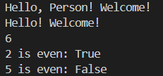
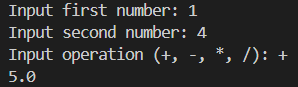
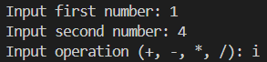
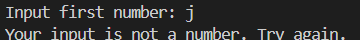
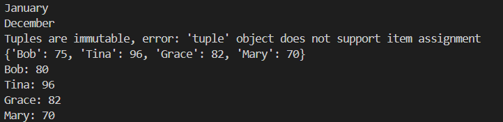
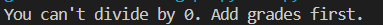
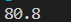
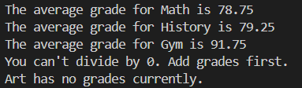
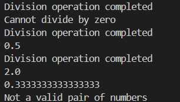

### Basic Functions
Main takeaway: using helper functions and storing function returns in variables

### Calculate
Main takeaway: learning how to use exceptions for the possible errors in the do_math() function

### Tuples/Dictionaries
Main takeaway: learning the differences between javascript and python when looping through a dictionary in syntax and behavior

### Data Processing
Main takeaway: learning how to structure try except blocks for this type of function and returning None for empty input errors

### Safe and Unsafe division
Main takeaway: proper exception and error handling
